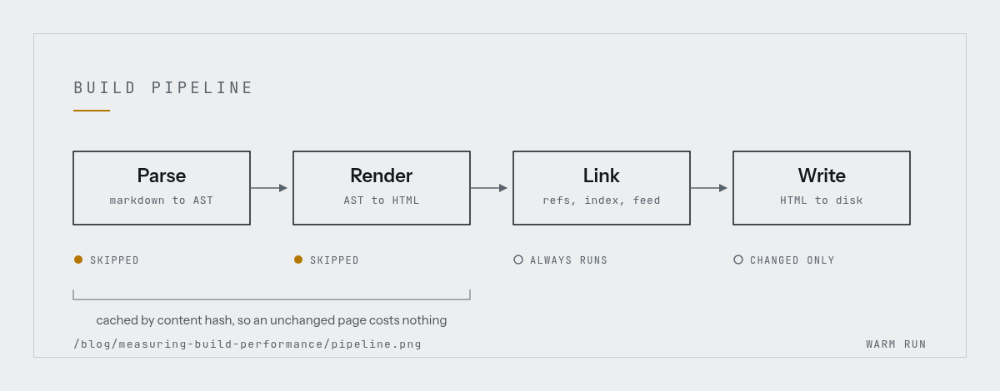

Every build tool advertises a cold build number. Cold builds are the one case that almost
never happens to you. What you feel is the *warm* build: the one after you changed a single
file, twenty times an hour, all day.

## The shape of the problem

A naive generator rebuilds everything. If a site has $n$ pages and each costs roughly the
same to parse and render, total work is $O(n)$ per keystroke, which is fine at fifty pages
and miserable at five thousand.

Write the cost of one build as the parse and render cost per page plus a linking pass:

$$
T(n) = \sum_{i=1}^{n} \bigl( t_{\text{parse}}(s_i) + t_{\text{render}}(s_i) \bigr) + t_{\text{link}}(n)
$$

The interesting term is $t_{\text{link}}$. Cross references, backlinks and a search index all
need to see every page, so they resist being made incremental. Getting the first sum down to
the pages that actually changed is the easy half.

If only $k$ pages are dirty, the achievable bound is

$$
T_{\text{warm}}(n, k) = \Theta(k) + \Theta(n)
$$

and that stubborn $\Theta(n)$ is the thing worth attacking second.

### Numbers from the migration

| Site size | Cold build | Warm, before | Warm, after | Change |
|----------:|-----------:|-------------:|------------:|-------:|
|       120 |      1.4 s |        1.3 s |      0.08 s |   -94% |
|     1 200 |     11.2 s |       10.8 s |      0.11 s |   -99% |
|     5 000 |     52.6 s |       51.9 s |      0.34 s |   -99% |
|    12 000 |    141.0 s |      138.4 s |      1.90 s |   -99% |

The warm column before the change is essentially the cold column, which is the whole point.
Nothing was being reused.

## Where the time actually goes

Do not trust wall clock time from a shell loop. Sample the process instead:

```bash
# 99 samples a second, for as long as the build runs
perf record -F 99 -g -- node ./build.js
perf script | stackcollapse-perf.pl | flamegraph.pl > build.svg
```

The first flame graph said 61% of the time was in markdown parsing. The second one, after
caching parsed ASTs, said 58% was in writing files. Fixing the first bottleneck just promotes
the next one.



> Optimise the stage you can skip entirely before optimising the stage you can make faster.
> Skipping is a hundred percent saving and it is usually less work.

## What changed

The cache key is the thing that matters. Hash the inputs, not the output path:

```js
import { createHash } from 'node:crypto';

/** Content hash of a page plus everything that can change how it renders. */
export function cacheKey(page, config) {
  return createHash('sha256')
    .update(page.raw)
    .update(page.frontmatterDigest)
    .update(config.version)
    .digest('hex')
    .slice(0, 16);
}
```

Three rules that survived contact with reality:

1. **Hash inputs, never timestamps.** `mtime` changes when git checks a file out, and you
   will rebuild the world after every branch switch.
2. **Include the tool version in the key.** Otherwise upgrading the generator silently serves
   stale HTML.
3. **Make the cache easy to throw away.** A cache you are afraid to delete is a liability.
   `rm -rf .cache` should always be a safe answer.

A note on shell snippets in posts like this one: `$HOME` and `$PATH` are written literally and
stay that way, and a price range such as $50 to $100 is not maths either. Only genuine
delimiters become formulas.

---

The honest summary is that the cold build got about 8% slower, because hashing costs
something. Nobody has complained, because nobody waits for a cold build.
