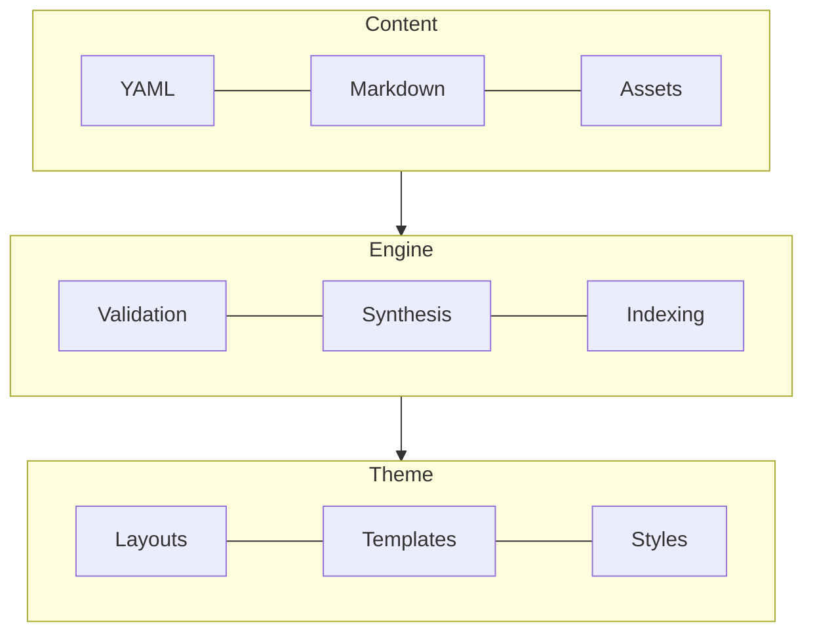

# Engine Architecture & Theme Authoring Guide

The engine compiles static, schema-validated portfolios. It acts as an abstraction bridge between content and presentation:




### Core Architecture Rules
1. **Strict Decoupling:** The engine never imports from the theme; the theme never accesses `content/` directly. All communication happens across a validated data boundary.
2. **Fail Loudly:** JSON Schemas enforce data integrity with `additionalProperties: false`. Invalid keys or missing required fields halt compilation with descriptive errors.
3. **Zero-Client Overhead:** Markdown, KaTeX mathematics, and syntax highlighting compile to static HTML at build time.

---

## 1. Commands & CLI Usage

```bash
npm run dev         # Starts local development server with hot reloading
npm run build       # Compiles static site to _site/
npm run validate    # Dry-run validation of content and schemas without writing files
npm test            # Runs the Vitest test suite
```

### CLI Flags
All commands accept flags to point to alternate directories or ports:

```bash
# Build with an external content repository
npm run build -- --content ../site-content

# Specify output directory
npm run build -- --content ../site-content --output dist

# Run dev server on a custom port
npm run dev -- --port 3000 --content ../site-content
```

---

## 2. Build Pipeline Lifecycle

When `loadEngineData()` or `node engine/cli.js build` executes, the engine runs through sequential pipeline phases:

1. **Load Data (`data-loader.js`):** Reads and validates `data.yaml` against `data.schema.json`. Normalizes profile assets and social link lists.
2. **Synthesize Collections (`collection-synthesizer.js`):**
   - Discovers entries across `blog`, `project`, `publication`, `certificate`, and `award`.
   - Parses Markdown frontmatter and bodies using `markdown-it` with KaTeX math (`$inline$`, `$$block$$`).
   - Generates tables of contents (`toc`), reading estimates (`reading-time`), excerpts, and permalinks.
   - Merges inline declarations from `content.yaml`.
   - Validates each entry against its specific collection schema (`<collection>.item.json`).
3. **Content Graph & Related Items (`content-graph.js`):**
   - Compiles an $O(N \cdot K)$ inverted skill index across all items.
   - Computes up to 3 relevant related items per entry based on shared skills and recency.
4. **Skills Taxonomy (`taxonomy.js`):** Builds an inverted index of all unique skills with $O(1)$ slug lookup for navigation and `/skills/<slug>/` hub pages.
5. **Theme Views (`collection-views.js`):** Prepares navigation counters, sorted collection feeds, adjacent entry pointers (`newer`/`older`), and SEO metadata.
6. **Search Indexing (`search-indexer.js`):** Builds a lightweight search document index written to `_site/search-index.json`.
7. **Eleventy Compilation:** Eleventy renders the theme templates, writes static HTML, and publishes assets.

---

## 3. Engine Surfaces (Data Contract for Themes)

The engine injects a comprehensive data contract available globally to all theme templates.

### Global Template Variables

| Variable | Description |
|---|---|
| `site` | Global site metadata (`url`, `title`, `description`, `lang`, `locale`, `accent`, `favicon`, `share_image`). |
| `profile` | Profile object (`name`, `handle`, `role`, `avatar`, `location`, `summary`, `skills`, `languages`, `resume`, `social`, `experience`, `education`). |
| `collections_data` | Dictionary mapping each collection name (`blog`, `project`, `publication`, `certificate`, `award`) to its sorted array of entries. |
| `collection_types` | Array describing each collection (`name`, `label`, `labelPlural`, `permalink`, `count`, `hasItems`) for building dynamic navigation. |
| `all_content` | Unified array of all collection items sorted chronologically. |
| `pinned_items` | Array of entries specified in `pinned_content` in author-curated order. |
| `taxonomy` | Skills index containing `skills`, `skillNames`, and `bySlug`. |
| `stats` | Total counts per collection and site-wide metrics. |
| `build` | Build metadata (`version`, `generatedAt`, `generatedYear`, `locale`). |

*Note: In Eleventy, `collections.blog` provides the standard Eleventy collection (used for pagination), while `collections_data.blog` provides the direct array.*

### Entry Data Model

Every collection entry carries pre-computed fields:

```typescript
interface Entry {
  title: string;
  slug: string;
  collection: 'blog' | 'project' | 'publication' | 'certificate' | 'award';
  permalink: string;           // e.g. "/project/glyphd/"
  link?: Array<{               // Action buttons (replaces old url/repository)
    label: string;
    url: string;
    icon?: string;
  }>;
  description?: string;
  excerpt?: string;            // Plain text teaser
  html?: string;               // Rendered HTML body (empty for inline entries)
  toc?: Array<{ id: string; slug: string; text: string; level: number }>;
  primaryDate: string;         // Common sort key across all collections
  dateDisplay: string;         // e.g. "Mar 2026" or "Jan 2022 – Present"
  dateIso: string;             // ISO 8601 string for <time datetime>
  isOngoing?: boolean;         // True when end date is "present"
  newer?: Entry | null;        // Chronologically newer adjacent entry
  older?: Entry | null;        // Chronologically older adjacent entry
  related?: Entry[];           // Up to 3 recommended related entries
  seo: {                       // Pre-computed SEO & OpenGraph tags
    canonicalUrl: string;
    title: string;
    description: string;
    image?: string;
  };
}
```

### Built-In Template Filters

- **Dates:** `formatDate(locale?)`, `dateRange(end, locale?)`, `isoDate`, `rfc822Date`, `duration(end)`.
- **Text & HTML:** `markdown`, `markdownInline`, `absoluteUrl(siteUrl)`, `absoluteUrls(siteUrl, pagePath)`.
- **Icons & SVGs:** `inlineSvg`, `inlineThemedSvg`, `renderIcon(nameOrPath)`, `makeSvgSymbolic`.
- **Collections:** `byRecency`, `where(key, value)`, `whereNot(key, value)`, `limit(n)`, `sortBy(key, desc)`, `union(a, b)`.

---

## 4. Building a Custom Theme

A theme lives in `theme/` and requires only templates and static styling:

```
theme/
├── _includes/                 # Reusable partials, macros, navigation
├── _layouts/                  # Base HTML wrappers (e.g. base.njk)
├── static/                    # Fonts, icons, images, CSS (published at matching paths)
├── index.njk                  # Home page
├── cv.njk                     # CV / Resume page
├── blog.njk                   # Blog index (or collection templates)
├── entry.njk                  # Single entry detail view
└── search.njk                 # Search interface
```

### Minimal Theme Example

**`theme/_layouts/base.njk`**
```njk
<!doctype html>
<html lang="{{ site.lang }}">
  <head>
    <meta charset="utf-8">
    <title>{{ title or site.title }}</title>
    <link rel="stylesheet" href="/static/site.css">
  </head>
  <body>
    <header>
      <a href="/">{{ profile.name }}</a>
      <p>{{ profile.role }}</p>
    </header>
    <main>{{ content | safe }}</main>
  </body>
</html>
```

**`theme/index.njk`**
```njk
---
layout: base.njk
title: Home
---
<h2>Selected Work</h2>
<ul>
  
    <li><a href="{{ item.permalink }}">{{ item.title }}</a> ({{ item.collection }})</li>
  
</ul>

<h2>Recent Writing</h2>
<ul>
  
    <li>
      <a href="{{ post.permalink }}">{{ post.title }}</a>
      <time datetime="{{ post.dateIso }}">{{ post.dateDisplay }}</time>
    </li>
  
</ul>
```

### Asset Publishing
Any non-underscored directory inside `theme/` (such as `theme/static/` or `theme/assets/`) is copied directly to the compiled site root (`_site/static/`, `_site/assets/`).

### Search Integration
The engine outputs `_site/search-index.json`. Themes can consume this file with client-side libraries like MiniSearch for instantaneous full-text fuzzy search:

```javascript
import MiniSearch from 'minisearch';

const res = await fetch('/search-index.json');
const data = await res.json();
const miniSearch = new MiniSearch({
  fields: ['title', 'skills', 'subtitle', 'description', 'content'],
  storeFields: ['title', 'subtitle', 'permalink', 'typeLabel', 'dateDisplay'],
  searchOptions: {
    boost: { title: 4, skills: 3, subtitle: 2, description: 1 },
    fuzzy: 0.2,
    prefix: true
  }
});
miniSearch.addAll(data.records || []);
const results = miniSearch.search('typescript');
```

---

## 5. Testing & Verification

The engine includes a Vitest test suite covering schemas, loaders, normalization, indexing, ordering, and theme surface contracts:

```bash
npm test
```
